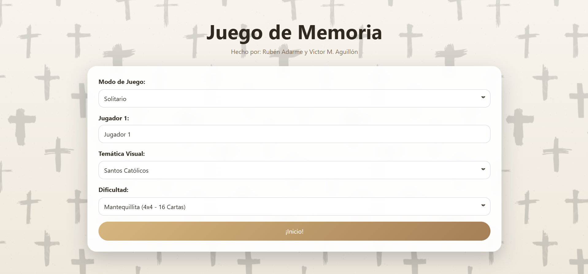
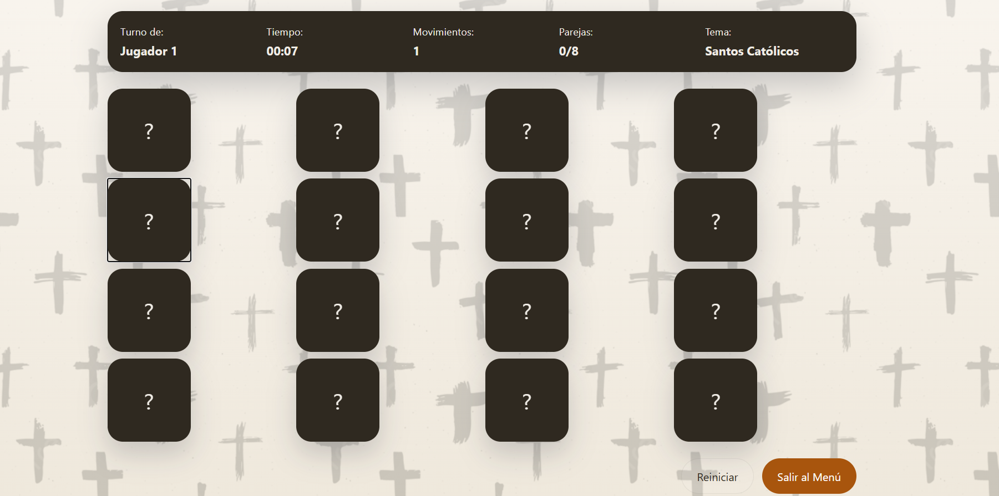
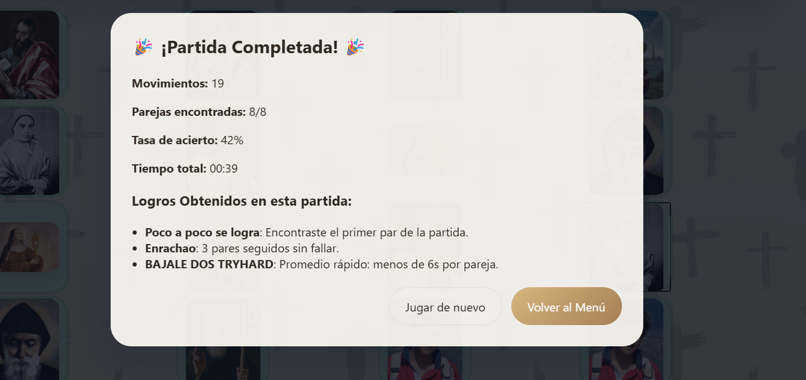
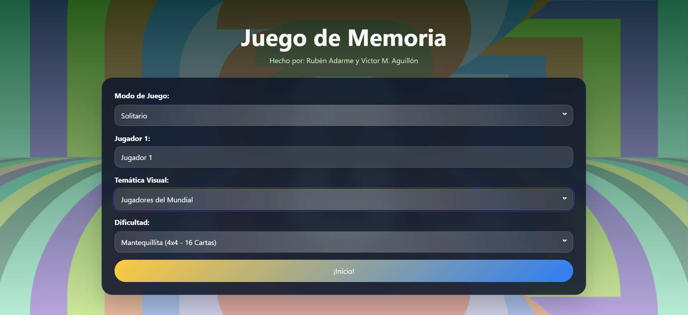
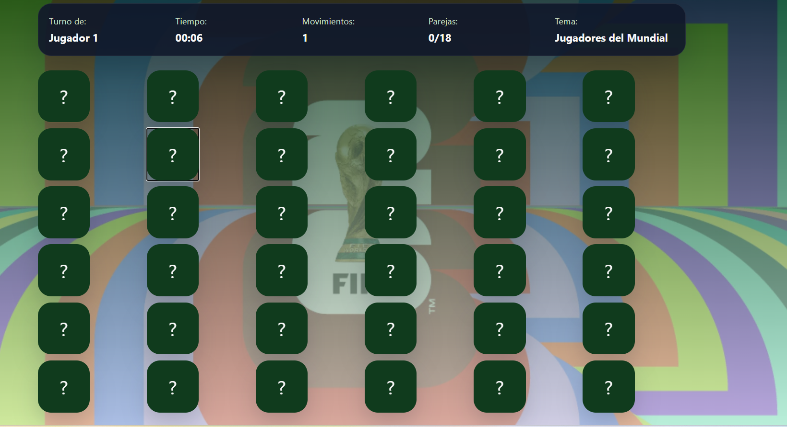
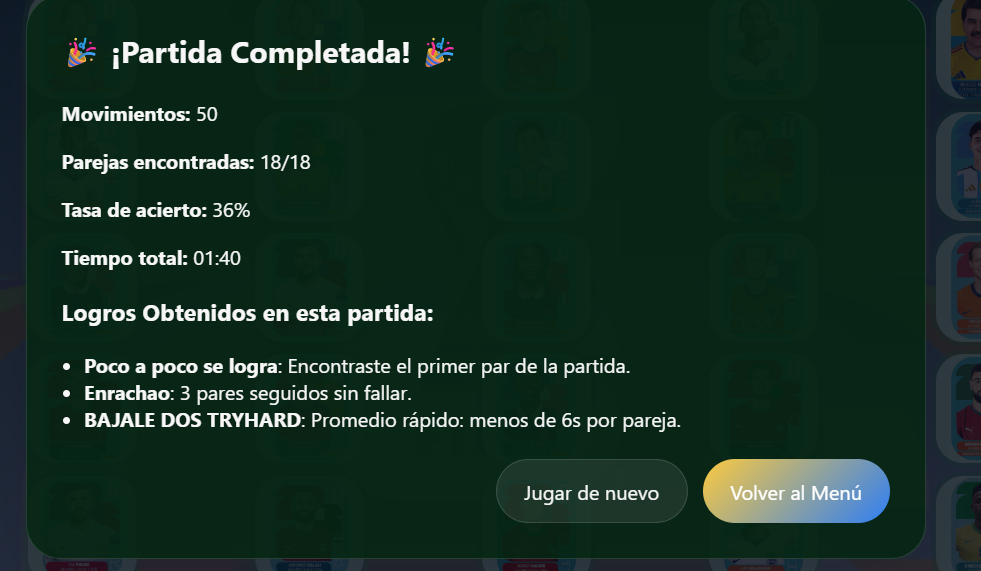
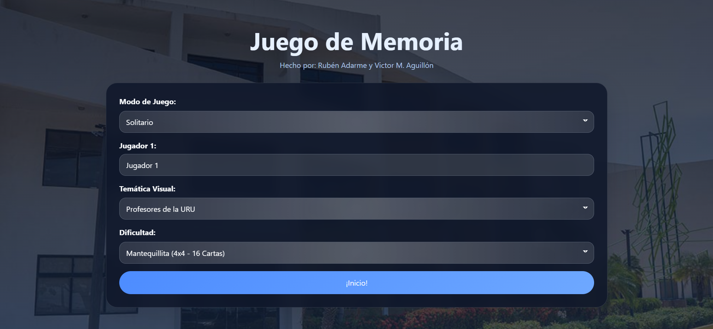
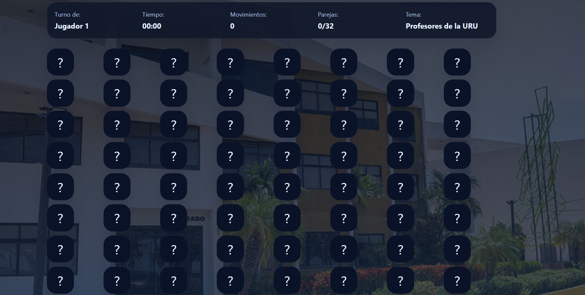
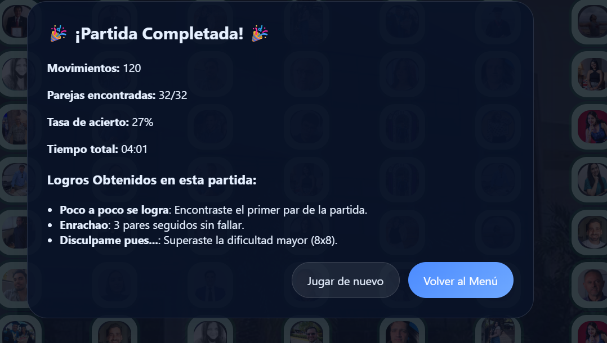

# 🎮 Memoriza a los Cracks. 

**Juego de memoria web estático** creado con HTML, CSS y JavaScript. El objetivo es encontrar parejas de cartas usando temáticas visuales atractivas, con modos solitario y versus, varias dificultades y logros desbloqueables.

---

## 🚀 Descripción
- Escoge una temática visual.
- Voltea cartas y encuentra parejas.
- Juega en modo `Solitario`, `Versus (PvP)` o `Modo Libre`.
- Elige dificultad 4x4, 6x6 o 8x8.
- Desbloquea logros según tu rendimiento.

---

## 👥 Equipo
- **Rubén Adarme** — Diseño UI/CSS, lógica de juego, temas visuales, assets.
- **Victor M. Aguillón** — Etiquetado, lógica del juego, estado, modos y logros.

---

## 🎨 Temáticas implementadas
| Tema | Clave | Carpeta de imágenes |
|---|---|---|
| Santos Católicos | `saints` | `assets/themes/saints` |
| Jugadores del Mundial | `worldcup` | `assets/themes/players` |
| Profesores URU | `professors` | `assets/themes/uru` |

---

## 🏆 Logros y condiciones
- **Poco a poco se logra** (`firstPair`): primer par encontrado.
- **Enrachao** (`hotStreak`): 3 pares seguidos sin fallar.
- **Cortita y al pie** (`firstTry`): primer intento y primer par.
- **Despacio cerebrito** (`flash`): completo Fácil (16 cartas) en <= 30s.
- **Velocista** (`velocista`): completo Medio (36 cartas) en <= 90s.
- **LOCURAAAAAAA** (`perfection`): completas todas las parejas sin errores.
- **Disculpame pues...** (`proplayer`): superas 8x8 (64 cartas).
- **BAJALE DOS TRYHARD** (`tryhard`): promedio de tiempo < 6s por pareja.

> Las condiciones de logro se evalúan en `js/achievements.js`.

---

## 🖼️ Capturas de pantalla por temática

### Santos Católicos
- Pantalla principal

  

- Tablero en juego

  

- Fin de partida

  

---

### Jugadores del Mundial
- Pantalla principal

  

- Tablero en juego

  

- Fin de partida

  

---

### Profesores URU
- Pantalla principal

  

- Tablero en juego

  

- Fin de partida

  

---

## ⚙️ Cómo ejecutar
1. Abrir `index.html` directamente en el navegador.

O usar un servidor local:

```bash
python -m http.server 8000
```

Luego abrir:

```text
http://localhost:8000
```

---

## 📌 Notas finales
- Para agregar un nuevo tema: coloca imágenes en `assets/themes/<nombre>` y añade el tema en `js/themes.js`.
- Para agregar logros: define la condición en `js/achievements.js`.
- El proyecto no requiere dependencias ni compilación.
